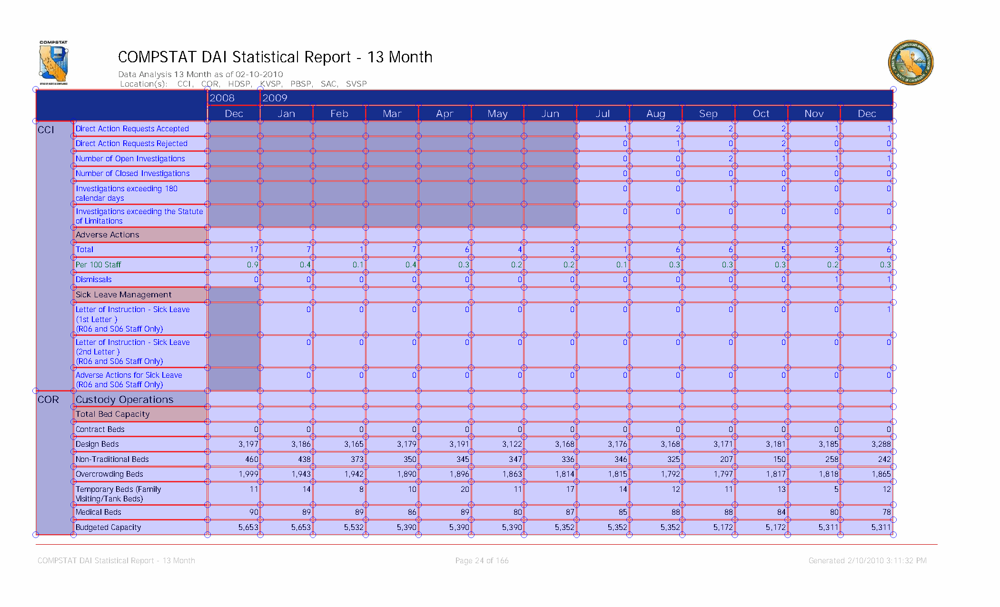
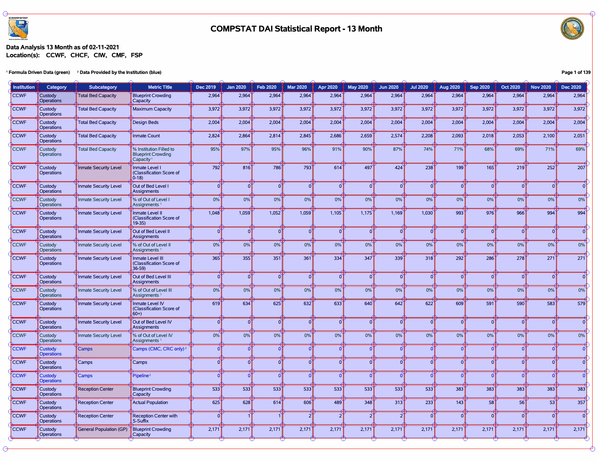
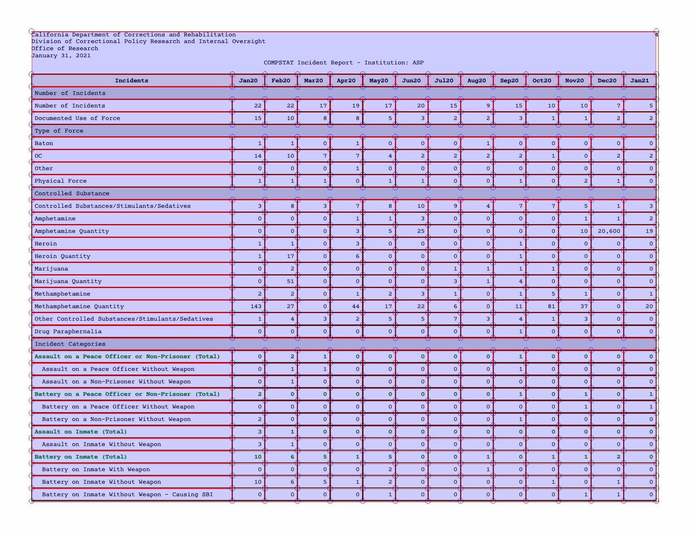
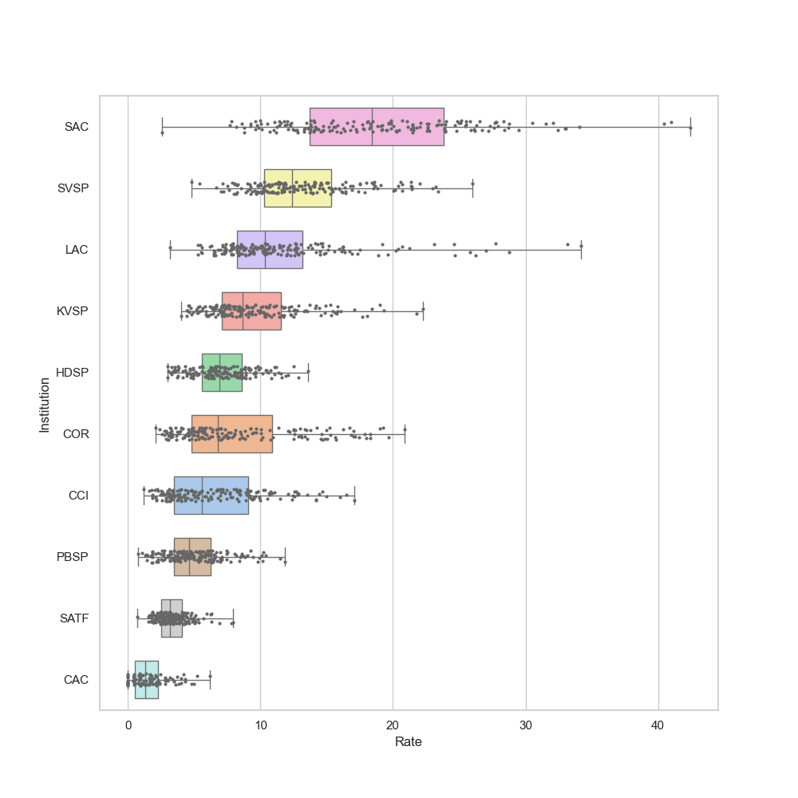

# California Prison Data 2009-2023

## California Department of Corrections and Rehabilitation COMPSTAT and incident data

This repository is a project by Jeremy Rue and Amanda Glazer working with KQED regarding Use of Force cases by prisons in California.

Specifically, we are comparing Use of Force rates (adjusted by population) of high security prisons in California from 2009 to 2023. 

CDCR does not publish historical data on their website, so we drew from many public records requests. 

Special thanks to [Jeremy Singer-Vine](https://www.jsvine.com/) of the Data Liberation Project. Without his amazing [PDFPlumber](https://github.com/jsvine/pdfplumber) tool and his amazing session at NICAR 2024, this would not be possible.

## [scrape-pdf-2009-2019.ipynb](scrape-pdf-2009-2019.ipynb)

This notebooks scrapes COMPSTAT PDFs from CDCR and saves the output into the finished-csvs folder. Because of the extensive length of each PDF, running the main part of this notebook takes approximately 20-30 minutes. A progress bar is provided to monitor the process. 

Note: because this PDF is structured with some rows using colored text signifying as headers for rows below, there are many repeating rows throughout this data. Anyone interested in a specific metric should analyze the order of the rows and verify by looking at the original PDF file.

You can access the finished .csv file for this scraper here: [finished-csvs/finished-2009-2019-everything.csv](finished-csvs/finished-2009-2019-everything.csv)

## [scrape-pdf-2020-2023-population.ipynb](scrape-pdf-2020-2023-population.ipynb)

This notebook has COMPSTAT reports from Jan 2020 to June 2023. Because these sheets contain the last month of the previous year, we only extract from Jan-Dec on each sheet. 

The .csv export can be accessed here: [finished-csvs/finished-2020-2023-population.csv](finished-csvs/finished-2020-2023-population.csv)

## [scrape-pdf-2020-2023-incidents.ipynb](scrape-pdf-2020-2023-incidents.ipynb)

For some reason CDCR started omitting Use of Force (UOF) metrics starting in 2020. In order to compare UOF with population, we pulled in from a separate incident report. These incident reports have overlapping columns resulting in some duplicated rows in the data. In 2020, UOF metrics for some prisions was listed on the above population document but with zeros, while on this incident report document, they contained non-zero values that we confirmed were true. Some additional data cleaning may be required for UOF analysis.

The .csv export can be accessed here: [finished-csvs/finished-2020-2023-incidents.csv](finished-csvs/finished-2020-2023-incidents.csv)

## [merged-pdfs.ipynb](merged-pdfs.ipynb)

This notebook shows one method of merging the three .csv files above in order to get a complete dataset. It melts the data into a long format. The result is a large 300mb .csv file, which was not included in Github. 

## [analysis.ipynb](analysis.ipynb)

A work-in-progress for formatting the data to compare rates of Use of Force by prisons. Of one note is Sacramento's high Use of Force cases compared to other high security prisons.

Data on Use of Force comparison among high security prisons can be downloaded here: [use_of_force.csv](analysis/use_of_force.csv)

